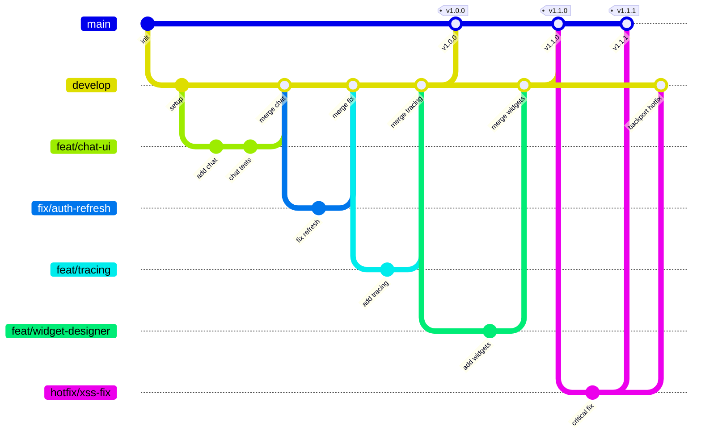

# unified-ui Frontend

[](https://github.com/unified-ui/unified-ui-frontend-service/actions/workflows/ci-tests-and-lint.yml)
[](https://www.typescriptlang.org/)
[](https://react.dev/)
[](LICENSE)
[](https://eslint.org/)

> **One interface for all your AI agents** — The unified frontend for managing and interacting with heterogeneous AI systems.

## What is unified-ui?

**unified-ui** transforms the complexity of managing multiple AI systems into a single, cohesive experience. Organizations deploy agents across diverse platforms — Microsoft Foundry, n8n, LangGraph, Copilot, and custom solutions — resulting in fragmented user experiences, inconsistent monitoring, and operational silos.

unified-ui eliminates these challenges by providing **one interface where every agent converges**.

## What is this Frontend?

The **unified-ui Frontend** is the React-based web application that provides the user interface for the entire unified-ui platform:

| Feature                          | Description                                               |
| -------------------------------- | --------------------------------------------------------- |
| 🎯 **Unified Chat Interface**    | Single chat experience for all AI agents                  |
| 🔌 **Multi-Platform Support**    | Microsoft Foundry, n8n, LangGraph, Copilot, custom agents |
| 🎨 **Widget Designer**           | Create embeddable chat widgets for external websites      |
| 📊 **Centralized Tracing**       | Visual trace exploration with canvas and hierarchy views  |
| 🔐 **Enterprise Authentication** | Microsoft Entra ID, Google, AWS Cognito                   |
| 🏢 **Multi-Tenant Architecture** | Organization & tenant-level RBAC                          |
| 🤖 **ReACT Agent Developer**     | In-browser agent development and testing environment      |
| 🌍 **i18n Ready**                | Internationalization with i18next (English)               |

### How It Fits

```
┌─────────────────┐     ┌──────────────────────────────────────────────┐
│  Frontend       │────▶│         Platform Service (FastAPI)           │
│  (this app) ◀───┼─SSE─│  • Authentication & RBAC                     │
└─────────────────┘     │  • Tenants, Applications, Credentials        │
                        │  • Conversations, Autonomous Agents          │
                        └──────────────────┬───────────────────────────┘
                                           │
              ┌────────────────────────────┼────────────────────────┐
              ▼                            ▼                        ▼
     ┌────────────────┐        ┌────────────────┐        ┌────────────────┐
     │ Agent Service  │        │ ReACT Agent    │        │ External App   │
     │  (Go/Gin)      │        │  Service       │        │                │
     └────────────────┘        └────────────────┘        └────────────────┘
              │                        │                          │
              ▼                        ▼                          ▼
     ┌────────────────────────────────────────────────────────────────┐
     │ AI Backends: N8N, Microsoft Foundry, LangGraph, OpenAI, ...   │
     └────────────────────────────────────────────────────────────────┘
```

---

## Tech Stack

| Category           | Technology                 |
| ------------------ | -------------------------- |
| **Framework**      | React 19                   |
| **Language**       | TypeScript 5.9             |
| **Build Tool**     | Vite 7                     |
| **UI Library**     | Mantine v8                 |
| **Icons**          | Tabler Icons               |
| **Routing**        | React Router 7             |
| **State**          | React Context              |
| **Authentication** | MSAL / Google / Cognito    |
| **i18n**           | i18next + react-i18next    |
| **Testing**        | Vitest + RTL + MSW         |
| **Linting**        | ESLint + TypeScript strict |

---

## Getting Started

### Prerequisites

- **Node.js** 22+ (recommended)
- **npm** 10+
- Azure AD App Registration (for authentication)

### Installation

```bash
# Clone the repository
git clone https://github.com/unified-ui/unified-ui-frontend-service.git
cd unified-ui-frontend-service

# Install dependencies
npm install

# Install pre-commit hooks
pre-commit install
pre-commit install --hook-type commit-msg

# Start development server
npm run dev
```

The app runs at `http://localhost:5173`

### Common Commands

| Command                      | Description                       |
| ---------------------------- | --------------------------------- |
| `npm run dev`                | Start development server with HMR |
| `npm run build`              | Build for production              |
| `npm run preview`            | Preview production build          |
| `npm run lint`               | Run ESLint                        |
| `npx vitest run`             | Run tests                         |
| `npx vitest run --coverage`  | Tests + coverage                  |
| `npx tsc --noEmit`           | Type check                        |
| `pre-commit run --all-files` | Run all pre-commit hooks          |

> **See [TOOLING.md](TOOLING.md)** for the full tooling guide, pre-commit hooks, and CI details.

---

## Configuration

### Environment Variables

Copy `.env.example` to `.env` and configure:

```env
# API endpoints
VITE_API_BASE_URL=http://localhost:8000
VITE_AGENT_SERVICE_URL=http://localhost:8085

# Azure AD / MSAL — from the App Registration (see platform service SETUP.md)
VITE_MSAL_CLIENT_ID=your-app-registration-client-id
VITE_MSAL_AUTHORITY=https://login.microsoftonline.com/your-tenant-id
VITE_MSAL_API_SCOPE=api://your-client-id/access_as_user
```

| Variable                 | Description                                               |
| ------------------------ | --------------------------------------------------------- |
| `VITE_API_BASE_URL`      | Platform service URL                                      |
| `VITE_AGENT_SERVICE_URL` | Agent service URL                                         |
| `VITE_MSAL_CLIENT_ID`    | Azure App Registration client ID                          |
| `VITE_MSAL_AUTHORITY`    | Azure AD authority URL (with tenant ID for single-tenant) |
| `VITE_MSAL_API_SCOPE`    | API scope from App Registration → "Expose an API"         |

### Authentication (OBO Flow)

The frontend uses MSAL to authenticate users via Microsoft Entra ID. Instead of requesting Graph API permissions directly, it requests an API-scoped token (`api://{client_id}/access_as_user`). The platform service then exchanges this token for a Graph token using the OAuth 2.0 On-Behalf-Of (OBO) flow.

For full App Registration setup instructions, see the **platform service** [SETUP.md](../unified-ui-platform-service/SETUP.md).

---

## Project Structure

```
unified-ui-frontend-service/
├── src/
│   ├── api/                 # API client (~130 methods) and types (~1500 lines)
│   ├── auth/                # Multi-provider authentication (MSAL, Google, Cognito)
│   ├── components/
│   │   ├── chat/            # Chat UI (ChatView, ChatContent, ChatInput, ChatHeader)
│   │   ├── common/          # Shared components (DataTable, Breadcrumbs, PermissionGate, ...)
│   │   ├── conversation/    # Conversation sidebar
│   │   ├── dialogs/         # Create/Edit dialogs for all entities
│   │   ├── layout/          # MainLayout, Header, Sidebar, GlobalChatSidebar
│   │   └── tracing/         # Trace visualization (canvas, hierarchy, data views)
│   ├── config/              # Branding configuration
│   ├── contexts/            # React context providers (10 contexts)
│   ├── hooks/               # Custom hooks (chat, conversation, entity management)
│   ├── i18n/                # Internationalization (12 namespaces, en-US)
│   ├── pages/               # 15 page components
│   ├── routes/              # Route definitions + ProtectedRoute
│   ├── styles/              # CSS custom properties (design tokens)
│   ├── test/                # Test setup, MSW mocks, utilities
│   ├── theme/               # Mantine theme configuration
│   └── utils/               # Shared utility functions
├── docs/                    # Documentation
│   └── adr/                 # Architecture Decision Records
├── .github/                 # CI workflows, issue templates, Copilot instructions
└── ...config files
```

---

## Branching Strategy

This project follows a **Simplified Flow** branching model — optimized for continuous integration with clear release paths.



### Branch Types

| Branch            | Purpose                                                    | Branches from | Merges into        |
| ----------------- | ---------------------------------------------------------- | ------------- | ------------------ |
| `main`            | Production-ready code — every merge is a release candidate | —             | —                  |
| `develop`         | Integration branch for features and fixes                  | `main`        | `main`             |
| `feat/<name>`     | New features or enhancements                               | `develop`     | `develop`          |
| `fix/<name>`      | Bug fixes (non-critical)                                   | `develop`     | `develop`          |
| `hotfix/<name>`   | Critical production fixes                                  | `main`        | `main` + `develop` |
| `docs/<name>`     | Documentation-only changes                                 | `develop`     | `develop`          |
| `refactor/<name>` | Code restructuring without behavior changes                | `develop`     | `develop`          |
| `test/<name>`     | Adding or improving tests                                  | `develop`     | `develop`          |
| `ci/<name>`       | CI/CD pipeline changes                                     | `develop`     | `develop`          |
| `chore/<name>`    | Maintenance tasks                                          | `develop`     | `develop`          |

### Workflow

1. **Feature/Fix development** — Create a `feat/` or `fix/` branch from `develop`. Open a PR back into `develop`.
2. **Release** — When ready, open a PR from `develop` to `main`. On merge, Release Drafter automatically generates a release draft.
3. **Hotfixes** — For critical bugs, create a `hotfix/` branch from `main`, fix, and PR to `main`. Then backport to `develop`.

### Rules

- **Never commit directly** to `main` or `develop` — always use PRs
- **All PRs require** passing CI (tests, lint, type check, build)
- **Squash merge** feature/fix branches into `develop` for a clean history
- **Branch naming**: `<type>/<short-description>` (e.g. `feat/chat-ui`, `fix/auth-refresh`)

### CI Checks on PRs

| Check                 | Description                                                                                    |
| --------------------- | ---------------------------------------------------------------------------------------------- |
| **Branch naming**     | Source branch must follow `<type>/` convention                                                 |
| **PR target rules**   | `main` ← `develop` or `hotfix/*` only                                                          |
| **PR target rules**   | `develop` ← `feat/*`, `fix/*`, `docs/*`, `refactor/*`, `test/*`, `ci/*`, `chore/*`, `hotfix/*` |
| **Lint**              | TypeScript type check + ESLint                                                                 |
| **Test**              | Vitest test suite                                                                              |
| **Build**             | Production build must succeed                                                                  |
| **CodeQL**            | Security vulnerability scanning                                                                |
| **Dependency Review** | License + severity check on dependency changes                                                 |

---

## Contributing

Contributions are welcome! Please read [CONTRIBUTING.md](CONTRIBUTING.md) for details on our development workflow, code standards, and how to submit pull requests.

---

## Sponsors

If you find this project useful, consider [sponsoring](SPONSORS.md) its development.

---

## License

MIT License — see [LICENSE](LICENSE) for details.
